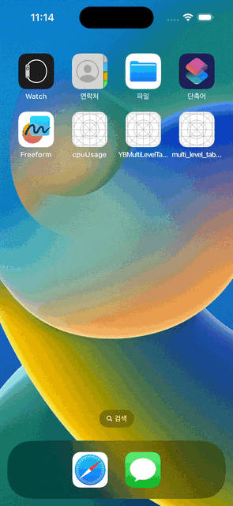

# cpuUsage-App
아이폰 실시간 리소스 사용량 확인 앱 입니다. 

## 사용 화면

* 위 사용 화면에서 개인 정보 보호를 위해 uuid, ip 는 공란으로 별도 처리하였습니다. 

## 해당 앱을 통해서 얻을 수 있는 기술

* `UIAlertAction` 함수를 이용한 알림 또는 경고창 출력
* `timer` 등록 방법
* `UIDecive`, `ProcessInfo` 를 통한 디바이스 정보 습득
* `subView` 를 이용한 toast message 출력 
* `multi level tableViewCell` 구현
* `getifaddrs`을 이용한 인터페이스 정보 추출